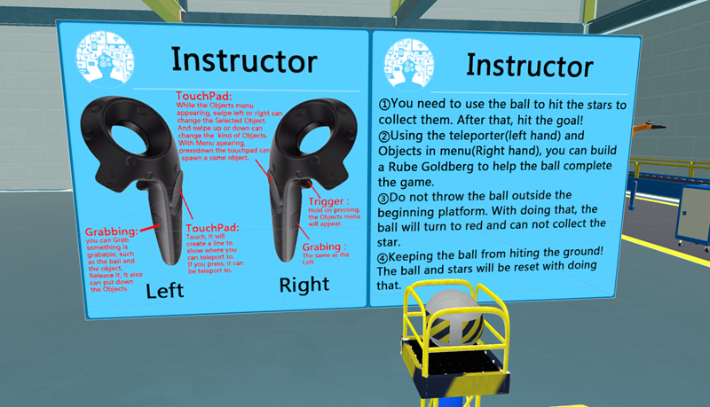
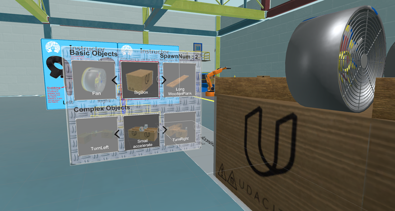
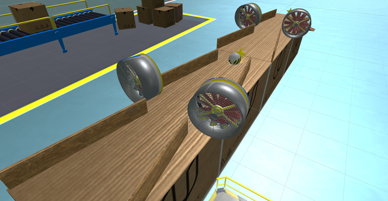

# RubeGoldbergFactory - SteamVR

Build with Udacity's model,  Add some custom function.

--by Zidong Lin(梓栋 林)

*****************************

### Support
* SteamVR plugin for Unity - v1.2.2
* Virtual Reality Supported(OpenVR)
* EditorVersion: Unity 5.5.1f1

*****************************

### File Directory
* Assets
* Build
 - RubeGoldbergFactory.exe
 - RubeGoldbergFactory_Data
* ProjectSettings
* ScreenShot
 - 3 Screenshot images
* README.md

*****************************
### V1.5.2 Features
1.Fix the teleport problem, and add the function to make the lineRender become a curve.
2.Fix the ObjectsMenu, and separate the UI and spawn system.
3.Fix the ball,which can be grabbing now.
4.Complete the Anti-cheat function.

### V1.0.0 Features
1. SteamVR supported.
2. Optimize the code.
3. Add Teleportation with left controller.
4. Create an Object Menu(UI) with right controller.And make it can spawn the Object you need.
5. Using 6 Complex and 10 basic Rube Goldberg objects to build your RubeGoldberg.
6. Make 4 level with star collected in different place.
7. Create anti-cheat code inorder to release the ball in right place.

*****************************
### Experience
I hope the ObjectMenu UI is clear enough. Using different shapes, physics materials objects to build up a way to complete the goal sounds really funny.GET CREATIVE!

